# TabPrompter

## A Chrome Extension to reformat tabs and chords for easy playing

### Reasoning

Every time I sit down at the computer to play covers, I copy the text from Ultimate Guitar and paste it into a plaintext editor, adjusting font sizes and custom column widths to get the chords just right so I can play the whole song without scrolling or getting lost.

I made TabPrompter as a Chrome Extension to do that work for me, so I can spend less time copying and pasting, and more time playing music.

---

### Installation

Latest release download: [TabPrompter v0.1.0](https://github.com/jeromeeno/tabprompter/releases/tag/v0.1.0)

1. Download or clone this repository.
2. Open `chrome://extensions` in Chrome.
3. Turn on `Developer mode`.
4. Click `Load unpacked`.
5. Select the downloaded or cloned `TabPrompter` project folder.
6. Open any supported Ultimate Guitar page and TabPrompter will load automatically.

---

### Features

- Reformats Ultimate Guitar pages into a cleaner teleprompter-style reading view.
- Fits songs into screen-sized columns so you can play without constant scrolling.
- Works with Guitar Chords, Tabs, Ukulele, Bass, and Drums in filtered search.
- Filters out Official, Pro, MuseScore, Vocal, Video, and Power results.
- Includes one-click search handoff from a song page.
- Supports transpose, text resizing, refit, theme switching, and saved preferences.
- Shows chord-shape diagrams on standard guitar chord pages.

### Screenshots

#### Guitar Chords

#### Guitar Tabs

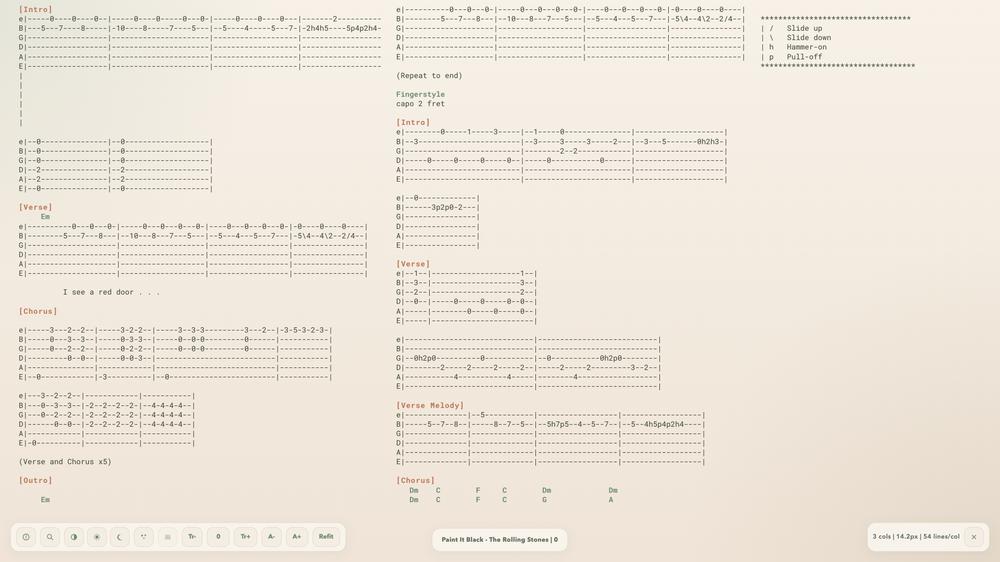

#### Ukulele

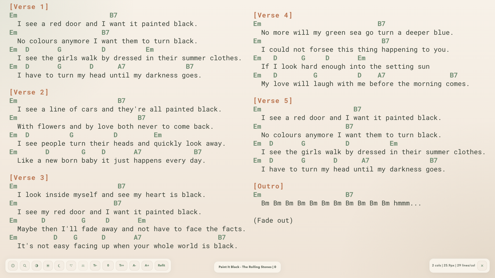

#### Bass

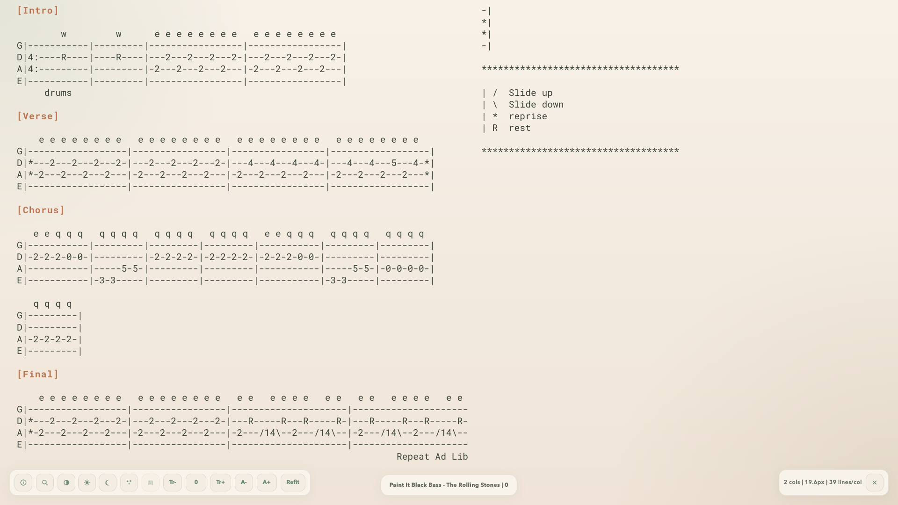

#### Drums

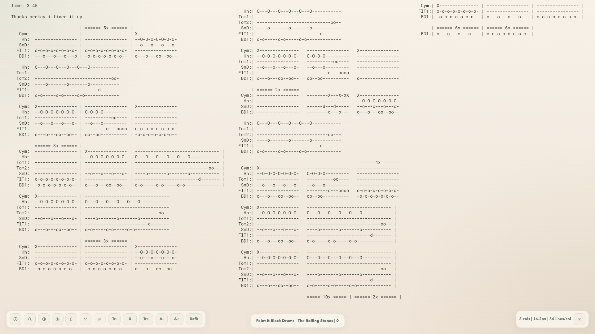

#### Search

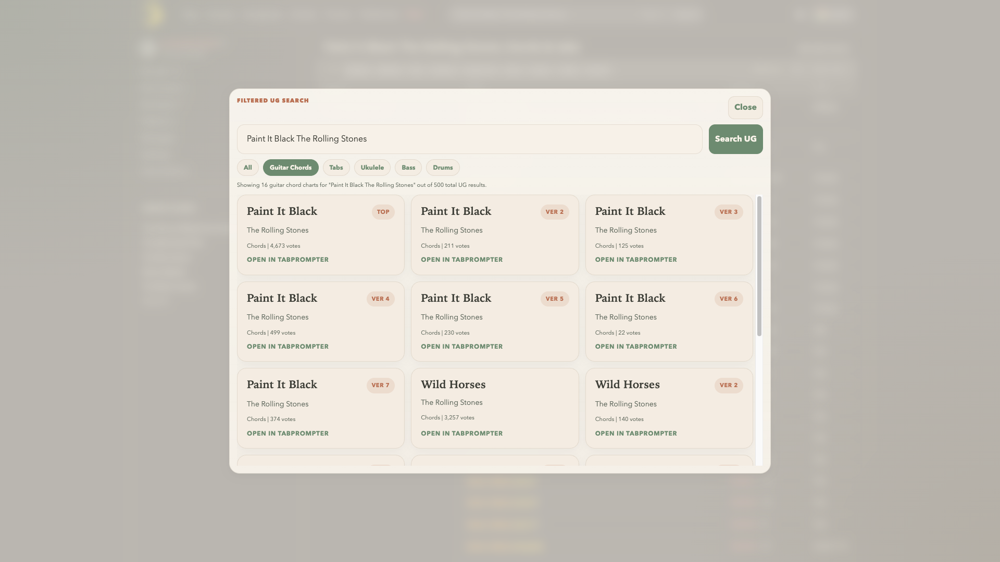

#### Info & Settings

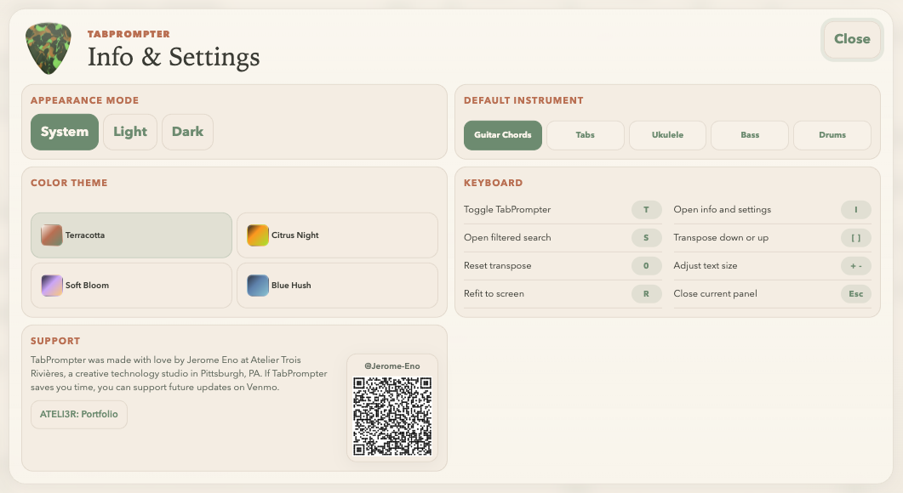

### Color Themes

#### Terracotta

| Dark | Light |
| --- | --- |
| 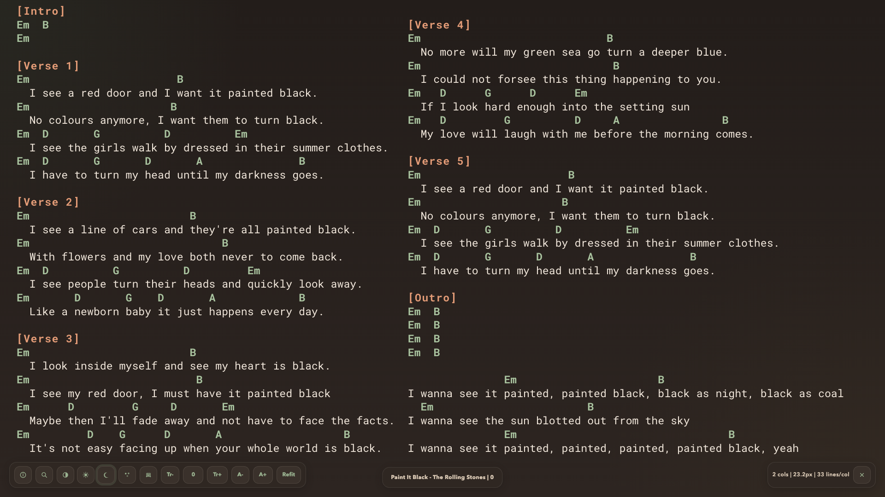 | 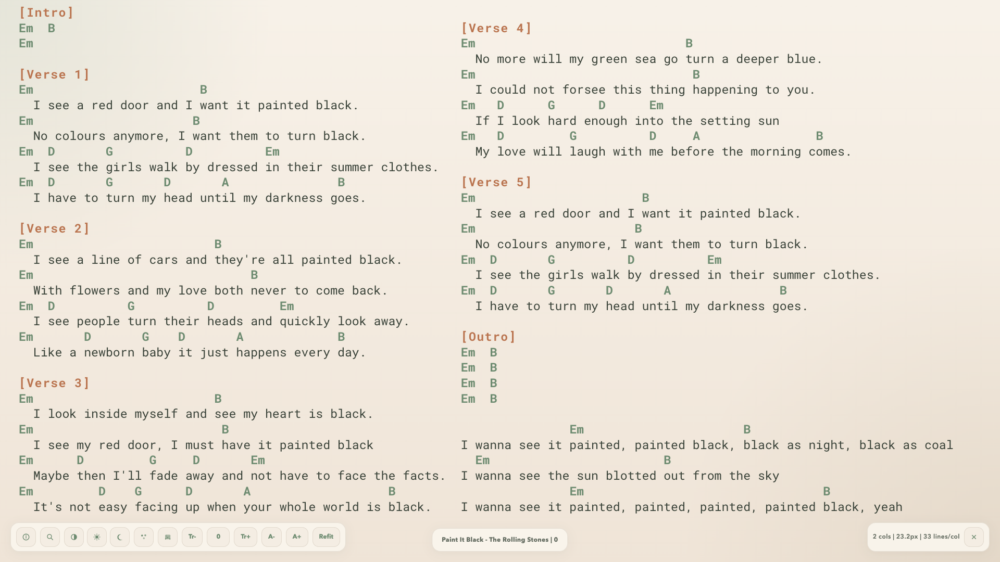 |

#### Citrus Night

| Dark | Light |
| --- | --- |
| 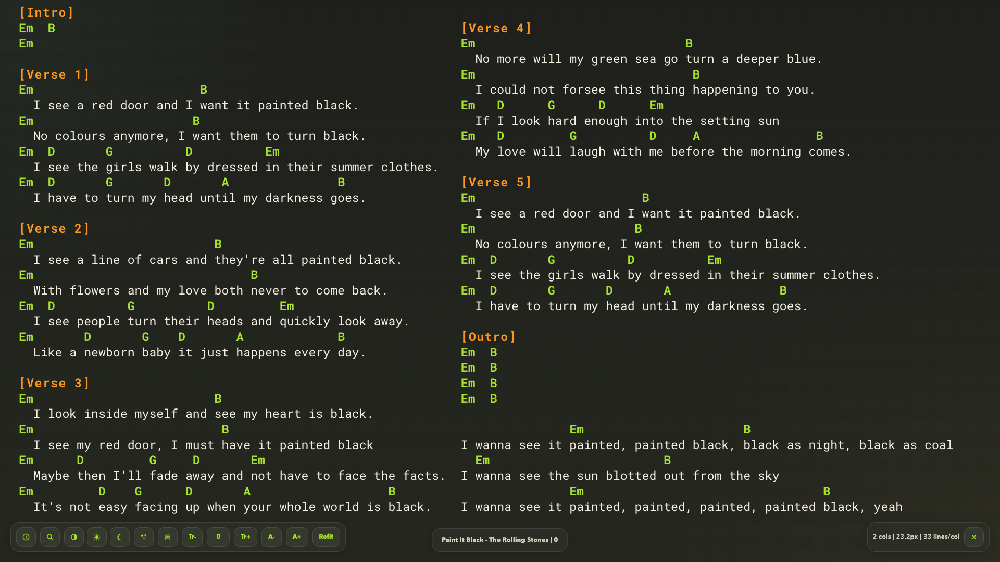 | 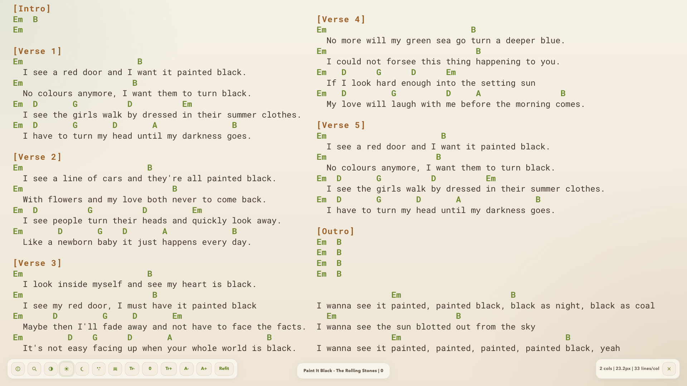 |

#### Soft Bloom

| Dark | Light |
| --- | --- |
| 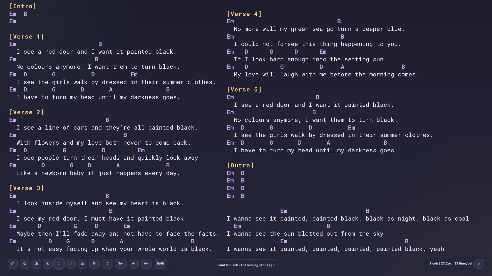 | 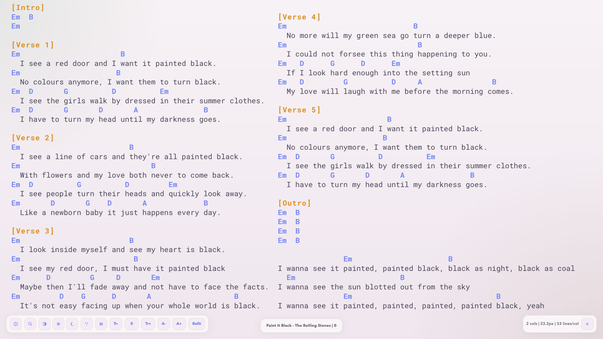 |

#### Blue Hush

| Dark | Light |
| --- | --- |
| 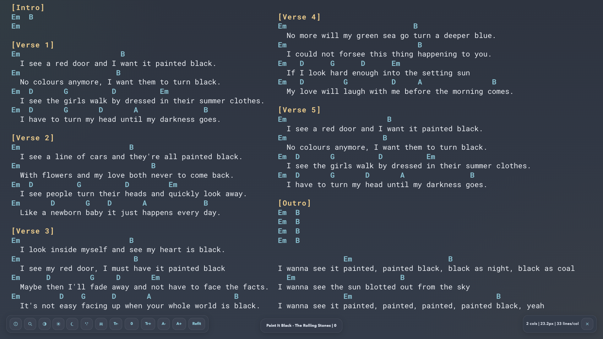 | 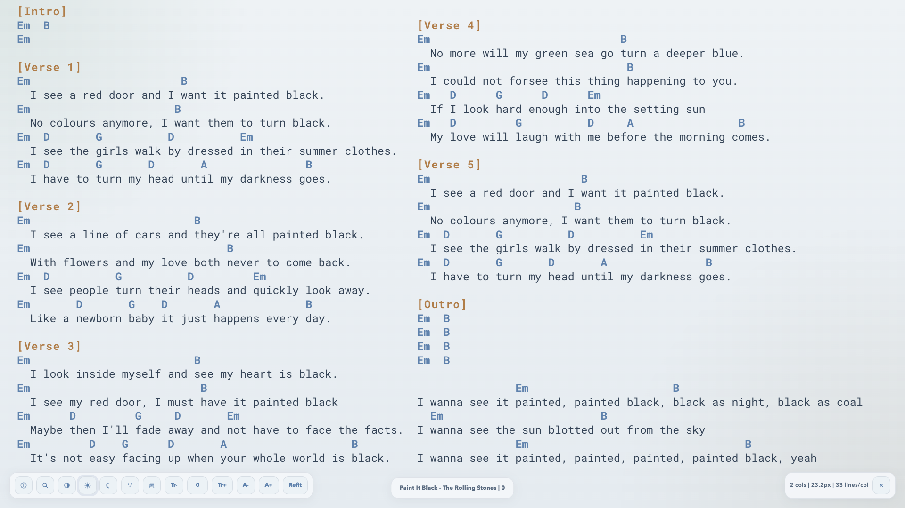 |

#### Keyboard Shortcuts

- `T` toggle TabPrompter
- `I` open Info & Settings
- `S` open filtered search
- `[` / `]` transpose down / up
- `0` reset transpose
- `-` / `+` decrease / increase text size
- `R` refit layout
- `Esc` close the current panel or exit the prompter

#### Notes

- TabPrompter is tuned for current Ultimate Guitar page structure and may need updates if the site changes.
- Chord-shape diagrams are currently for standard guitar chord pages only.

---

### License

This project is licensed under the MIT License. See [LICENSE](LICENSE).

---

### Support

TabPrompter was made with love by Jerome Eno at Atelier Trois Rivieres, a creative technology studio in Pittsburgh, PA. If TabPrompter saves you time, you can support future updates on [Venmo](https://account.venmo.com/u/jerome-eno)

View my portfolio at [ATELI3R](https://www.ateli3r.xyz/).
